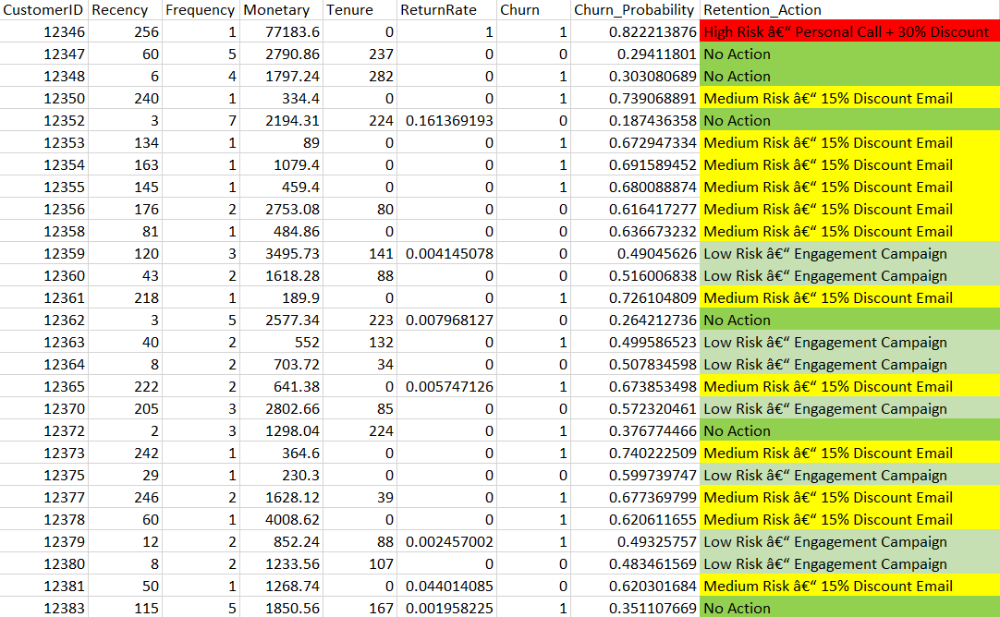

# Customer Churn Prediction & Retention Decision Engine

## 📌 Project Overview
This project builds an **end-to-end churn prediction system** using e-commerce transactional data and converts model outputs into **actionable retention strategies**.

Unlike basic churn models, this project focuses on:
- Preventing **data leakage**
- Using **probability-based decision making**
- Aligning machine learning outputs with **real business actions**

---

## 🎯 Business Objective
Identify customers who are likely to **stop purchasing in the near future** and proactively apply **cost-effective retention strategies** based on churn risk.

---

## 🧠 Churn Definition (Critical Design Choice)
Churn is defined using a **time-based approach**:

- **Observation Window:** Transactions before September  
- **Prediction Window:** September to December  

A customer is labeled as **churned (1)** if they made **no purchases during the prediction window**.

> This mirrors real-world business decision cycles and avoids temporal data leakage.

---

## 🚨 Data Leakage Prevention
To ensure realistic model performance:
- All customer features were engineered **only from past data**
- Churn labels were derived **strictly from future behavior**

This resulted in **deployable and trustworthy model performance**, rather than inflated metrics.

---

## 🗂️ Dataset
- Source: Online Retail transactional dataset
- Granularity: Invoice-level transactions
- Key fields: CustomerID, InvoiceDate, Quantity, UnitPrice, Returns

---

## 🛠️ Feature Engineering
Transactional data was aggregated to customer-level features:

| Feature | Description |
|------|------------|
| Recency | Days since last purchase |
| Frequency | Number of unique invoices |
| Monetary | Total spend |
| Tenure | Customer lifespan (days) |
| ReturnRate | Returned quantity / total quantity |

---

## 🤖 Model Building
- **Algorithm:** Logistic Regression
- **Why Logistic Regression?**
  - Interpretable coefficients
  - Stable probability estimates
  - Business-friendly explanations

### 📊 Model Performance
- ROC-AUC ≈ **0.75**
- Balanced precision–recall tradeoff
- Performance validated after leakage correction

---

## 🔍 Feature Importance (Coefficients)
Model coefficients were analyzed to understand key churn drivers such as:
- Purchase frequency
- Customer recency
- Tenure and return behavior

---

## ⚙️ Retention Decision Engine
Instead of hard churn labels, the model outputs **churn probabilities**, which drive a rule-based decision engine:

| Churn Probability | Retention Action |
|------------------|-----------------|
| ≥ 0.80 | High Risk – Personal Call + 30% Discount |
| 0.60 – 0.79 | Medium Risk – 15% Discount Email |
| 0.40 – 0.59 | Low Risk – Engagement Campaign |
| < 0.40 | No Action |

This ensures **marketing budget optimization** and targeted intervention.

---

## 🧩 System Architecture
Customer Transactions
    ↓
Feature Engineering (RFM + Returns)
    ↓
Logistic Regression Model
    ↓
Churn Probability
    ↓
Retention Decision Engine
    ↓
Business Action

---
## 📊 Business Outputs & Presentation

### Retention Decision Output
A final customer-level output was generated containing churn probability and recommended retention action.  
This output is designed for direct use by marketing and retention teams.

### Project Walkthrough Presentation
A detailed project walkthrough is available as a PowerPoint presentation, covering:
- Problem framing
- Churn definition
- Data leakage prevention
- Feature engineering
- Model evaluation
- Retention strategy design

 **[see presentation : (PDF)](presentation/customer_churn_detection.pdf)**

## 📓 Notebook Walkthrough
The complete analysis and modeling workflow is available in a Jupyter Notebook:

 `notebooks/churn_modeling.ipynb`

## 💡 Key Takeaways
- Demonstrates **real-world churn modeling**
- Explicit handling of **data leakage**
- ML outputs translated into **business decisions**
- Combines analytics, modeling, and strategy

---

## 🚀 Future Improvements
- Cost–benefit optimization for retention offers
- Model calibration and uplift modeling
- Campaign impact simulation

